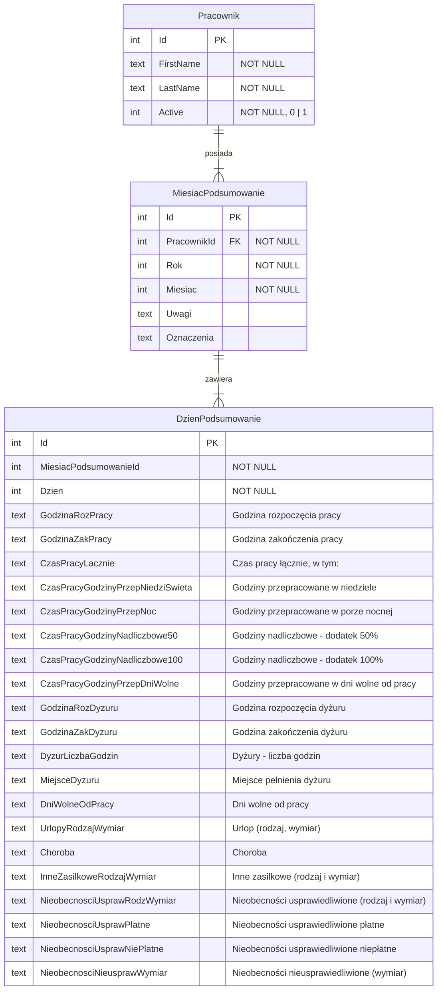

# employees_time_manager_app
GUI app
https://www.pythonguis.com/

```mermaid
erDiagram
    Pracownik ||--|{ MiesiacPodsumowanie : posiada
    Pracownik {
        int Id PK
        text FirstName "NOT NULL"
        text LastName "NOT NULL"
        int Active "NOT NULL, 0 | 1" 
    }
    MiesiacPodsumowanie ||--|{ DzienPodsumowanie : zawiera
    MiesiacPodsumowanie {
        int Id PK
        int PracownikId FK "NOT NULL"
        int Rok "NOT NULL"
        int Miesiac "NOT NULL"
        text Uwagi
        text Oznaczenia
    }
    DzienPodsumowanie {
        int Id PK
        int MiesiacPodsumowanieId "NOT NULL"
        int Dzien "NOT NULL"
        text GodzinaRozPracy "Godzina rozpoczęcia pracy"
        text GodzinaZakPracy "Godzina zakończenia pracy"
        text CzasPracyLacznie "Czas pracy łącznie, w tym:"
        text CzasPracyGodzinyPrzepNiedziSwieta "Godziny przepracowane w niedziele"
        text CzasPracyGodzinyPrzepNoc "Godziny przepracowane w porze nocnej"
        text CzasPracyGodzinyNadliczbowe50 "Godziny nadliczbowe - dodatek 50%"
        text CzasPracyGodzinyNadliczbowe100 "Godziny nadliczbowe - dodatek 100%"
        text CzasPracyGodzinyPrzepDniWolne "Godziny przepracowane w dni wolne od pracy"
        text GodzinaRozDyzuru "Godzina rozpoczęcia dyżuru"
        text GodzinaZakDyzuru "Godzina zakończenia dyżuru"
        text DyzurLiczbaGodzin "Dyżury - liczba godzin"
        text MiejsceDyzuru "Miejsce pełnienia dyżuru"
        text DniWolneOdPracy "Dni wolne od pracy"
        text UrlopyRodzajWymiar "Urlop (rodzaj, wymiar)"
        text Choroba "Choroba"
        text InneZasilkoweRodzajWymiar "Inne zasilkowe (rodzaj i wymiar)"
        text NieobecnosciUsprawRodzWymiar "Nieobecności usprawiedliwione (rodzaj i wymiar)"
        text NieobecnosciUsprawPlatne "Nieobecności usprawiedliwione płatne"
        text NieobecnosciUsprawNiePlatne "Nieobecności usprawiedliwione niepłatne"
        text NieobecnosciNieusprawWymiar "Nieobecności nieusprawiedliwione (wymiar)"
    }

```